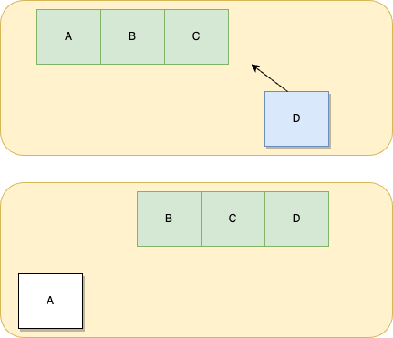

# FixedCache Container

## Description

A fixed-size container for caching objects.

- Non-blocking
- FIFO

## Usage
```cpp
    // @Foo: Foo is the type of object to cache
    // @3: the fixed-size of the cache
    cache::Cache<Foo, 3> cachePool;

    // update new cache
    cachePool.Update(Foo("a"));

    // get latest cache
    bool ok = false;
    auto foo = cachePool.Peek(ok);
```

## Cache simply preview
```c++
    foo::User foo1;
    foo1.set_id(1);
    foo1.set_name("foo1");

    foo::User foo2;
    foo2.set_id(2);
    foo2.set_name("foo2");

    foo::User foo3;
    foo3.set_id(3);
    foo3.set_name("foo3");


    cache::Cache<foo::User, 3> UserCache;

    UserCache.Update(foo1);
    bool exist = false;

    auto bar1 = UserCache.Peek(&exist);
    EXPECT_EQ(exist, true);
    EXPECT_EQ(bar1.id(), 1);
    EXPECT_EQ(bar1.name(), "foo1");

    UserCache.Update(foo2);
    auto bar2 = UserCache.Peek(&exist);
    EXPECT_EQ(exist, true);
    EXPECT_EQ(bar2.id(), 2);
    EXPECT_EQ(bar2.name(), "foo2");

    UserCache.Update(foo3);
    auto bar3 = UserCache.Peek(&exist);
    EXPECT_EQ(exist, true);
    EXPECT_EQ(bar3.id(), 3);
    EXPECT_EQ(bar3.name(), "foo3");

    // overwrite
    UserCache.Update(foo1);
    auto bar4 = UserCache.Peek(&exist);
    EXPECT_EQ(exist, true);
    EXPECT_EQ(bar4.id(), 1);
    EXPECT_EQ(bar4.name(), "foo1");

    // update
    UserCache.Update(foo2);
    auto bar5 = UserCache.Peek(&exist);
    EXPECT_EQ(exist, true);
    EXPECT_EQ(bar5.id(), 2);
    EXPECT_EQ(bar5.name(), "foo2");

```

## Graph


